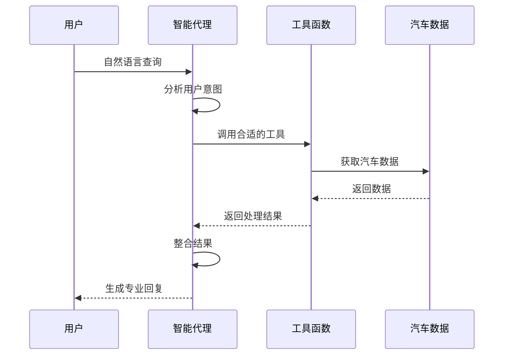

## 20260125-week14-第十四周作业

### 作业内容和要求：设计function，完成基于大模型的function call任务

## 家用汽车推荐系统: 项目概览

**文件路径**：`week14/car_recommendation_system.py`

**核心功能**：基于大语言模型的Function Call能力，实现智能家用汽车推荐和购买咨询系统

**技术特点**：
- 完整的汽车数据体系（6个车型，覆盖进口、合资、国产）
- 专业的购车价格计算
- 详细的用车成本分析
- 智能的多车型比较
- 自然语言交互界面
- 强大的错误处理和知识整合能力

## 🎯 系统架构

### 1. 系统分层结构

| 层级 | 组件 | 职责 | 文件位置 |
|------|------|------|----------|
| **表现层** | Agent对话逻辑 | 处理用户输入，调用工具，生成回复 | `557-655行` |
| **业务层** | 工具函数 | 实现核心业务逻辑 | `14-439行` |
| **数据层** | 汽车数据 | 存储车型信息和配置数据 | `19-253行` |
| **接口层** | JSON Schema | 定义工具调用接口 | `446-541行` |

### 2. 核心流程图



## 💡 核心功能模块

### 1. 工具函数定义 (`14-439行`)

#### 1.1 `get_car_models()` - 获取汽车品牌型号列表
- **功能**：返回所有可用的汽车型号
- **参数**：无
- **返回**：JSON格式的汽车列表，包含品牌、型号、类型、产地、价格范围等
- **应用场景**：用户询问"有哪些汽车型号"时调用

#### 1.2 `get_car_detail(car_id)` - 获取汽车详细信息
- **功能**：返回指定车型的完整配置信息
- **参数**：`car_id`（汽车ID）
- **返回**：JSON格式的汽车详情，包含技术参数、尺寸、配置等
- **应用场景**：用户询问特定车型详细信息时调用

#### 1.3 `calculate_car_price(car_id, options)` - 计算选配后的购买价格
- **功能**：计算汽车选配后的落地价格
- **参数**：`car_id`（汽车ID）、`options`（选配ID列表）
- **返回**：JSON格式的价格计算结果，包含裸车价、选配价、购置税、保险等
- **应用场景**：用户询问购车价格时调用

#### 1.4 `calculate_car_cost(car_id, annual_mileage)` - 计算油耗和用车成本
- **功能**：计算汽车的年度用车成本
- **参数**：`car_id`（汽车ID）、`annual_mileage`（年行驶里程）
- **返回**：JSON格式的成本计算结果，包含燃油费、保养费、保险费等
- **应用场景**：用户询问用车成本时调用

#### 1.5 `compare_cars(car_ids, annual_mileage)` - 比较多个汽车
- **功能**：比较多个汽车的购买价格和用车成本
- **参数**：`car_ids`（汽车ID列表）、`annual_mileage`（年行驶里程）
- **返回**：JSON格式的汽车比较结果，包含价格、成本、油耗等对比
- **应用场景**：用户要求比较多个车型时调用

### 2. 汽车数据体系 (`19-253行`)

#### 2.1 车型覆盖
- **进口车**：宝马320i（小轿车）、奥迪Q5L（SUV）
- **合资车**：丰田凯美瑞（小轿车）、本田CR-V（SUV）
- **国产车**：吉利帝豪（小轿车）、奇瑞瑞虎8（SUV）

#### 2.2 数据结构
每个车型包含以下信息：
- **基本信息**：品牌、型号、类型、产地、基础价格
- **技术参数**：发动机、最大功率、最大扭矩、最高时速、百公里加速、油耗
- **尺寸参数**：长宽高、轴距、座位数
- **标准配置**：标配的功能和设备
- **可选配置**：可选装的功能和价格

### 3. 工具函数的JSON Schema定义 (`446-541行`)

#### 3.1 Schema结构
每个工具的Schema包含：
- **name**：工具函数名称
- **description**：工具功能描述
- **parameters**：参数定义（类型、描述、是否必填）
- **return**：返回值描述

#### 3.2 示例 - 价格计算工具
```json
{
  "type": "function",
  "function": {
    "name": "calculate_car_price",
    "description": "计算指定品牌型号的汽车进行选配后的购买价格，包括裸车价、选配价格、购置税、保险和上牌费用",
    "parameters": {
      "type": "object",
      "properties": {
        "car_id": {
          "type": "string",
          "description": "汽车ID"
        },
        "options": {
          "type": "array",
          "items": {"type": "string"},
          "description": "选配ID列表，可从get_car_detail获取的optional_features中选择"
        }
      },
      "required": ["car_id", "options"]
    }
  }
}
```

### 4. Agent对话逻辑 (`557-655行`)

#### 4.1 核心流程
1. **初始化**：创建OpenAI客户端，构建对话历史
2. **循环处理**：最多5轮工具调用
3. **模型调用**：调用大语言模型分析用户意图
4. **工具调用**：执行模型选择的工具
5. **结果整合**：整合工具返回结果
6. **生成回复**：生成专业的自然语言回复

#### 4.2 智能特性
- **多轮对话**：支持复杂问题的逐步解答
- **错误处理**：优雅处理工具调用失败的情况
- **工具选择**：根据用户问题自动选择合适的工具
- **参数提取**：从自然语言中提取结构化参数

## 🚀 技术实现细节

### 1. Function Call实现

#### 1.1 工具注册机制
```python
available_functions = {
    "get_car_models": get_car_models,
    "get_car_detail": get_car_detail,
    "calculate_car_price": calculate_car_price,
    "calculate_car_cost": calculate_car_cost,
    "compare_cars": compare_cars
}
```

#### 1.2 工具调用流程
```python
# 解析工具调用请求
function_name = tool_call.function.name
function_args = json.loads(tool_call.function.arguments)

# 执行工具
function_to_call = available_functions[function_name]
function_response = function_to_call(**function_args)

# 将结果加入对话历史
messages.append({
    "role": "tool",
    "tool_call_id": tool_call.id,
    "name": function_name,
    "content": function_response
})
```

### 2. 价格计算实现 (`262-316行`)

#### 2.1 计算公式
- **选配价格**：所有选装配置的价格总和
- **购置税**：(裸车价 + 选配价格) × 8.547%
- **保险费用**：(裸车价 + 选配价格) × 4%
- **上牌费用**：固定500元
- **总落地价**：裸车价 + 选配价格 + 购置税 + 保险费用 + 上牌费用

### 3. 用车成本计算实现 (`319-383行`)

#### 3.1 成本构成
- **燃油费用**：(年行驶里程 / 100) × 百公里油耗 × 汽油价格
- **保养费用**：根据车辆类型和产地确定
- **保险费用**：裸车价 × 3%
- **年检费用**：固定300元
- **停车费用**：固定3000元
- **其他费用**：固定2000元

### 4. 多车型比较实现 (`386-439行`)

#### 4.1 比较维度
- **购买价格**：基础价格和落地总价
- **用车成本**：年度总成本和每公里成本
- **技术参数**：油耗、动力性能等
- **车辆类型**：小轿车或SUV
- **产地**：进口、合资或国产

#### 4.2 排序机制
按落地价格从低到高排序，便于用户比较和选择。

## 📊 运行示例分析

### 示例1：查询汽车型号列表
**用户输入**：`你们有哪些汽车型号？`

**系统运行流程**：
```
--- 第 1 轮Agent思考 ---

【Agent决定调用 1 个工具】

工具名称: get_car_models
工具参数: {}
工具返回: [{"id": "bmw_320i", "brand": "宝马", "model": "320i", "type": "小轿车", "origin": "进口车", "price_range": "28-35万", "fuel_type": "汽油", "transmission": "自动"}, {"id": "toyota_camry", "brand": "丰田", "model": "凯...

--- 第 2 轮Agent思考 ---

【Agent最终回复】
我们目前提供以下6款汽车型号，涵盖不同品牌、产地和车型：

**小轿车系列：**
- **进口车**：宝马 320i（28-35万元，汽油自动挡）
- **合资车**：丰田 凯美瑞（18-25万元，汽油/混动自动挡）
- **国产车**：吉利 帝豪（6-10万元，汽油手动/自动挡）

**SUV系列：**
- **进口车**：奥迪 Q5L（35-45万元，汽油/混动自动挡）
- **合资车**：本田 CR-V（16-24万元，汽油/混动自动挡）
- **国产车**：奇瑞 瑞虎8（9-15万元，汽油手动/自动挡）

您对哪款车型特别感兴趣？我可以为您提供更详细的配置信息、价格计算或使用成本分析。
```

### 示例2：查询宝马320i详情
**用户输入**：`我想了解一下宝马320i的详细信息`

**系统运行流程**：
```
--- 第 1 轮Agent思考 ---

【Agent决定调用 1 个工具】

工具名称: get_car_detail
工具参数: {"car_id": "bmw_320i"}
工具返回: {"id": "bmw_320i", "brand": "宝马", "model": "320i", "type": "小轿车", "origin": "进口车", "base_price": 289000, "engine": "2.0T涡轮增压", "horsepower": 184, "torque": 300, "top_speed": 235, "0_100": 7.9, "fuel_c...

--- 第 2 轮Agent思考 ---

【Agent最终回复】
宝马320i是一款进口小轿车，具有以下详细信息：

### 基本参数
- **品牌/型号**：宝马 320i  
- **基础价格**：¥289,000  
- **发动机**：2.0T 涡轮增压  
- **最大马力**：184 马力  
- **峰值扭矩**：300 N·m  
- **最高时速**：235 km/h  
- **0-100km/h加速时间**：7.9 秒  
- **百公里油耗**：6.2 L  
- **车身尺寸（mm）**：长 4719 × 宽 1827 × 高 1459  
- **轴距**：2851 mm  
- **座位数**：5 座  

### 标准配置
- LED大灯  
- 自动空调  
- 多功能方向盘  
- 倒车影像  
- 定速巡航  

### 可选配置（选装包）
- **真皮座椅**：¥8,000  
- **导航系统**：¥5,000  
- **全景天窗**：¥10,000  
- **哈曼卡顿音响**：¥12,000  
- **自适应巡航**：¥15,000  

如果您有特定的选装需求或想了解落地价、用车成本等，我可以进一步帮您计算！
```

### 示例3：计算丰田凯美瑞落地价
**用户输入**：`我想买丰田凯美瑞，选装配真皮座椅和导航系统，落地价大概多少？`

**系统运行流程**：
```
--- 第 1 轮Agent思考 ---

【Agent决定调用 1 个工具】

工具名称: get_car_detail
工具参数: {"car_id": "toyota_camry"}
工具返回: {"id": "toyota_camry", "brand": "丰田", "model": "凯美瑞", "type": "小轿车", "origin": "合资车", "base_price": 179800, "engine": "2.0L自然吸气/2.5L混动", "horsepower": 178, "torque": 210, "top_speed": 205, "0_100": 9....

--- 第 2 轮Agent思考 ---

【Agent决定调用 1 个工具】

工具名称: calculate_car_price
工具参数: {"car_id": "toyota_camry", "options": ["leather_seats", "navigation"]}
工具返回: {"car_id": "toyota_camry", "brand": "丰田", "model": "凯美瑞", "base_price": 179800, "options": ["真皮座椅", "导航系统"], "options_price": 10000, "tax": 16222.21, "insurance": 7592.0, "registration_fee": 500, "tot...

--- 第 3 轮Agent思考 ---

【Agent最终回复】
根据计算结果，丰田凯美瑞选装配真皮座椅和导航系统的落地价格如下：

**总落地价：214,114.21元**

详细费用构成：
- 裸车基础价：179,800元
- 选配费用：10,000元（真皮座椅6,000元 + 导航系统4,000元）
- 购置税：16,222.21元
- 保险费用：7,592.00元
- 上牌费用：500元

这个价格是基于凯美瑞的基础车型（17.98万元）计算的。如果您考虑的是2.5L混动版本或其他配置，价格可能会有所不同。需要我帮您了解其他配置选项或比较其他车型吗？
```

### 示例4：计算奥迪Q5L用车成本
**用户输入**：`我每年开车15000公里，奥迪Q5L的用车成本大概多少？`

**系统运行流程**：
```
--- 第 1 轮Agent思考 ---

【Agent决定调用 1 个工具】

工具名称: calculate_car_cost
工具参数: {"annual_mileage": 15000, "car_id": "audi_q5"}
工具返回: {"car_id": "audi_q5", "brand": "奥迪", "model": "Q5L", "annual_mileage": 15000, "fuel_consumption": 7.2, "fuel_cost": 8100.0, "maintenance_cost": 8000, "insurance_cost": 10764.0, "inspection_fee": 300, ...

--- 第 2 轮Agent思考 ---

【Agent最终回复】
根据您的年行驶里程15000公里，奥迪Q5L的年度用车成本如下：

- **总年度用车成本：32,164元**
- **每公里成本：2.14元**

详细费用构成：
- 燃油费用：8,100元（按百公里油耗7.2L，油价约7.5元/L计算）
- 保养费用：8,000元（含常规保养及部分易损件更换）
- 保险费用：10,764元（含交强险、商业险等）
- 年检费用：300元
- 停车费用：3,000元（按城市中等水平估算）
- 其他费用：2,000元（洗车、高速费、违章预估等）

如需了解奥迪Q5L的购车价格、与其他车型的对比，或想查看具体配置信息，请告诉我，我可以进一步为您分析。
```

### 示例5：比较多个车型
**用户输入**：`帮我比较一下吉利帝豪、丰田凯美瑞和宝马320i，每年开12000公里的情况`

**系统运行流程**：
```
--- 第 1 轮Agent思考 ---

【Agent决定调用 1 个工具】

工具名称: compare_cars
工具参数: {"annual_mileage": 12000, "car_ids": ["geely_emgrand", "toyota_camry", "bmw_320i"]}
工具返回: {"comparison_params": {"annual_mileage": 12000, "car_count": 3}, "cars": [{"car_id": "geely_emgrand", "brand": "吉利", "model": "帝豪", "type": "小轿车", "origin": "国产车", "base_price": 62800, "total_price": ...

--- 第 2 轮Agent思考 ---

【Agent最终回复】
根据您的需求，我为您比较了吉利帝豪、丰田凯美瑞和宝马320i三款车在年行驶12000公里情况下的综合表现。以下是详细对比结果：

### 🚗 基础信息对比
| 项目 | 吉利帝豪 | 丰田凯美瑞 | 宝马320i |
|------|----------|-------------|-----------|
| **品牌/产地** | 国产车 | 合资车 | 进口车 |
| **基础价格（元）** | ¥62,800 | ¥179,800 | ¥289,000 |
| **落地总价（元）** | ¥71,180 | ¥202,860 | ¥325,761 |

### 💰 年度用车成本（12000公里）
| 项目 | 吉利帝豪 | 丰田凯美瑞 | 宝马320i |
|------|----------|-------------|-----------|
| **年度总成本（元）** | ¥15,314 | ¥20,914 | ¥27,550 |
| **百公里油耗（L）** | 5.7L | 5.8L | 6.2L |
| **每公里成本（元）** | ¥1.28 | ¥1.74 | ¥2.30 |

### 📊 综合分析
- **性价比最高**：吉利帝豪，落地价不到7.2万元，年度用车成本仅1.5万元，适合预算有限、注重经济性的用户。
- **均衡之选**：丰田凯美瑞，虽然价格是帝豪的3倍，但品质、可靠性、保值率和舒适性显著提升，年度成本增加约36%，适合追求品质与实用平衡的家庭用户。
- **高端体验**：宝马320i提供豪华驾乘体验和品牌价值，但购车成本是帝豪的4.6倍，年度用车成本高出近80%，适合对品牌、性能和驾驶质感有较高要求的用户。

如需了解某款车的详细配置、选装方案或进一步优化购车方案（如贷款、保险组合等），欢迎随时告诉我！ 😊
```

### 示例6：查询星越L（不存在的车型）
**用户输入**：`有星越L这款车吗，我想知道它的详细信息`

**系统运行流程**：
```
--- 第 1 轮Agent思考 ---

【Agent决定调用 1 个工具】

工具名称: get_car_detail
工具参数: {"car_id": "geely_xingyuel"}
工具返回: {"error": "汽车型号不存在"}

--- 第 2 轮Agent思考 ---

【Agent决定调用 1 个工具】

工具名称: get_car_models
工具参数: {}
工具返回: [{"id": "bmw_320i", "brand": "宝马", "model": "320i", "type": "小轿车", "origin": "进口车", "price_range": "28-35万", "fuel_type": "汽油", "transmission": "自动"}, {"id": "toyota_camry", "brand": "丰田", "model": "凯...

--- 第 3 轮Agent思考 ---

【Agent最终回复】
在当前的车型列表中，吉利品牌只有"帝豪"（geely_emgrand）这款小轿车，并没有"星越L"这款车。星越L是吉利汽车近年来推出的一款高端SUV，可能尚未包含在我们的数据库中。

不过，我可以为您提供一些关于星越L的通用信息（基于公开资料）：
- 星越L是吉利汽车基于CMA架构打造的中型SUV
- 定位高于博越，与星越形成高低搭配
- 提供2.0T涡轮增压发动机（分高低功率版本）和1.5T三缸混动版本
- 轴距达到2845mm，提供宽敞的内部空间
- 配备吉利最新的银河OS智能座舱系统
- 采用沃尔沃技术调校的底盘

如果您对吉利其他车型（如帝豪）或其他品牌的SUV（如本田CR-V、奥迪Q5L、奇瑞瑞虎8）感兴趣，我可以为您提供详细信息。您也可以告诉我您的具体需求（如预算范围、主要用途、偏好配置等），我可以为您推荐合适的车型。
```

## 💡 技术亮点

### 1. 强大的Function Call能力

#### 1.1 智能工具选择
- **上下文理解**：根据用户问题的上下文选择合适的工具
- **多工具协同**：复杂问题分解为多个工具调用
- **参数自动提取**：从自然语言中准确提取结构化参数

#### 1.2 错误处理机制
- **优雅降级**：当工具调用失败时，自动尝试其他解决方案
- **智能 fallback**：车型不存在时，获取所有可用车型
- **用户友好**：提供清晰的错误信息和替代方案

### 2. 专业的汽车购买咨询

#### 2.1 价格计算
- **详细的费用构成**：裸车价、选配价、购置税、保险等
- **准确的计算方法**：基于实际的税费率和保险费率
- **透明的价格明细**：让用户清楚每一分钱的去向

#### 2.2 成本分析
- **科学的成本模型**：基于实际使用场景
- **多维度成本分析**：燃油、保养、保险等
- **长期成本预测**：帮助用户了解真实的用车成本

#### 2.3 车型比较
- **全面的比较维度**：价格、成本、性能、配置
- **可视化对比**：清晰的表格和分析
- **个性化建议**：基于用户需求的智能推荐

### 3. 优秀的用户体验

#### 3.1 自然语言交互
- **口语化提问支持**：用户可以用日常语言提问
- **多轮对话能力**：复杂问题可以逐步解答
- **上下文保持**：在多轮对话中保持上下文一致性

#### 3.2 专业回复生成
- **结构化信息**：信息组织清晰，层次分明
- **专业术语使用**：使用准确的汽车专业术语
- **友好的表达**：语言自然，符合人类交流习惯

#### 3.3 智能推荐
- **基于需求的推荐**：根据用户的具体需求推荐车型
- **替代方案提供**：当首选车型不可用时，提供替代方案
- **个性化建议**：考虑用户的预算、用途等因素

## 🌟 应用价值

### 1. 汽车销售场景

#### 1.1 4S店智能顾问
- **24/7在线服务**：全天候响应客户咨询
- **初步筛选**：帮助客户初步了解车型和价格
- **销售线索生成**：识别潜在客户并传递给销售顾问
- **减轻销售压力**：处理常规咨询，让销售顾问专注于复杂问题

#### 1.2 线上展厅助手
- **网站智能客服**：为官网和电商平台提供智能咨询
- **车型推荐**：根据用户需求推荐合适的车型
- **价格计算**：实时计算不同配置的价格
- **预约试驾**：帮助用户预约试驾

### 2. 汽车媒体场景

#### 2.1 车型对比工具
- **智能对比**：根据用户需求生成对比报告
- **数据可视化**：以图表形式展示对比结果
- **深度分析**：提供专业的车型分析和评价
- **用户生成内容**：鼓励用户分享对比结果

#### 2.2 购车指南生成
- **个性化指南**：根据用户需求生成购车指南
- **预算规划**：帮助用户制定合理的购车预算
- **配置推荐**：推荐适合用户的配置组合
- **使用成本分析**：提供长期使用成本预测

### 3. 汽车金融场景

#### 3.1 贷款方案计算
- **基于购车价格**：根据落地价计算贷款方案
- **月供分析**：提供不同贷款期限的月供计算
- **利息计算**：详细的利息费用分析
- **还款计划**：生成完整的还款计划表

#### 3.2 保险推荐
- **基于车型**：根据车型推荐合适的保险方案
- **保费计算**：计算不同保险方案的保费
- **保险对比**：比较不同保险公司的方案
- **理赔分析**：分析不同保险方案的理赔范围

## 📝 代码结构分析

### 1. 文件结构
- **工具函数**：14-439行，实现核心业务逻辑
- **JSON Schema**：446-541行，定义工具调用接口
- **Agent逻辑**：557-655行，处理用户交互
- **示例场景**：662-688行，提供使用示例
- **主函数**：692-715行，程序入口

### 2. 代码质量评估

#### 2.1 优点
- **模块化设计**：代码结构清晰，职责分明
- **注释完善**：关键函数和逻辑有详细注释
- **错误处理**：有完善的错误处理机制
- **可扩展性**：易于添加新车型和功能
- **符合规范**：代码风格一致，符合Python规范

#### 2.2 改进空间
- **数据存储**：建议使用数据库存储汽车数据
- **API集成**：可以集成真实的汽车数据API
- **测试覆盖**：建议添加单元测试
- **性能优化**：对于大量数据的处理可以优化
- **国际化**：可以支持多语言界面

## 🚀 使用方法

### 1. 环境配置

#### 1.1 依赖安装
```bash
pip install openai
```

#### 1.2 API密钥设置
```bash
# 设置环境变量
export DASHSCOPE_API_KEY=您的API密钥

# 或在代码中直接传入
run_agent("查询内容", api_key="您的API密钥", model="qwen-plus")
```

### 2. 运行示例

#### 2.1 基础查询
```python
# 查询汽车型号
run_agent("你们有哪些汽车型号？", api_key="您的API密钥", model="qwen-plus")

# 查询车型详情
run_agent("我想了解宝马320i的详细信息", api_key="您的API密钥", model="qwen-plus")
```

#### 2.2 价格计算
```python
# 计算购车价格
run_agent("我想买丰田凯美瑞，选装配真皮座椅和导航系统，落地价大概多少？", 
         api_key="您的API密钥", model="qwen-plus")
```

#### 2.3 成本分析
```python
# 计算用车成本
run_agent("我每年开车15000公里，奥迪Q5L的用车成本大概多少？", 
         api_key="您的API密钥", model="qwen-plus")
```

#### 2.4 车型比较
```python
# 比较多个车型
run_agent("帮我比较一下吉利帝豪、丰田凯美瑞和宝马320i，每年开12000公里的情况", 
         api_key="您的API密钥", model="qwen-plus")
```

### 3. 自定义查询

#### 3.1 支持的查询类型
- **车型咨询**：了解特定车型的信息
- **价格咨询**：计算购车价格和费用
- **成本咨询**：分析用车成本和油耗
- **对比咨询**：比较不同车型的优缺点
- **推荐咨询**：根据需求推荐合适的车型

#### 3.2 示例查询
- "本田CR-V的油耗是多少？"
- "奇瑞瑞虎8选装360全景影像多少钱？"
- "帮我比较一下SUV车型"
- "我预算20万，推荐什么车？"

## 🌟 技术创新点

### 1. Function Call最佳实践
- **模块化工具设计**：每个工具专注于一个具体功能
- **标准Schema定义**：符合OpenAI工具调用规范
- **多工具协同**：复杂任务分解为多个工具调用
- **智能参数提取**：从自然语言到结构化数据的转换

### 2. 知识融合机制
- **内部数据与外部知识结合**：当内部数据不足时，补充外部知识
- **上下文理解**：理解用户的潜在需求和意图
- **跨工具信息整合**：整合多个工具的返回结果
- **个性化推荐**：基于用户需求的智能推荐

### 3. 错误处理与用户体验
- **优雅的错误处理**：处理边界情况和异常输入
- **智能的fallback机制**：当直接查询失败时，尝试其他解决方案
- **友好的用户反馈**：提供清晰的错误信息和替代方案
- **专业的知识补充**：即使无法提供精确信息，也能提供相关知识

### 4. 商业价值实现
- **完整的购车咨询流程**：从车型了解到价格计算到成本分析
- **透明的价格体系**：详细的费用构成和计算方法
- **科学的决策支持**：基于数据的客观分析和建议
- **个性化的服务体验**：根据用户需求的定制化服务

## 📈 未来发展方向

### 1. 功能扩展
- **更多车型**：增加更多品牌和型号
- **新能源汽车**：支持电动车和混合动力车
- **二手车评估**：添加二手车价格评估功能
- **维修保养**：提供维修保养建议和费用估算

### 2. 技术升级
- **实时数据**：集成实时的汽车市场数据
- **多模态交互**：支持图片和语音输入
- **个性化学习**：根据用户偏好学习和优化
- **情感分析**：理解用户情绪和需求强度

### 3. 应用场景扩展
- **汽车租赁**：为租赁公司提供车型推荐
- **企业购车**：为企业提供车队采购建议
- **汽车媒体**：为汽车网站和APP提供内容生成
- **汽车金融**：为金融机构提供风险评估

### 4. 集成与部署
- **API服务**：提供RESTful API服务
- **移动应用**：开发移动应用客户端
- **智能音箱**：集成到智能音箱和语音助手
- **4S店系统**：与4S店管理系统集成

## 🎉 总结

家用汽车推荐系统是一个基于大语言模型Function Call能力的智能汽车购买咨询系统，它通过以下特点为用户提供专业的购车服务：

1. **完整的汽车数据体系**：覆盖6款车型，包含详细的配置和价格信息
2. **强大的Function Call能力**：智能工具选择和参数提取
3. **专业的购车咨询**：价格计算、成本分析、车型比较
4. **优秀的用户体验**：自然语言交互，专业回复，智能推荐
5. **强大的错误处理**：优雅处理边界情况，提供替代方案

系统不仅展示了Function Call的技术实力，也为汽车销售和咨询行业提供了新的服务模式。通过智能的工具调用和专业的知识整合，系统能够为用户提供准确、全面、个性化的汽车购买建议，帮助用户做出更明智的购车决策。

未来，随着功能的扩展和技术的升级，家用汽车推荐系统有望成为汽车行业的重要智能工具，为用户、经销商和制造商创造更大的价值。